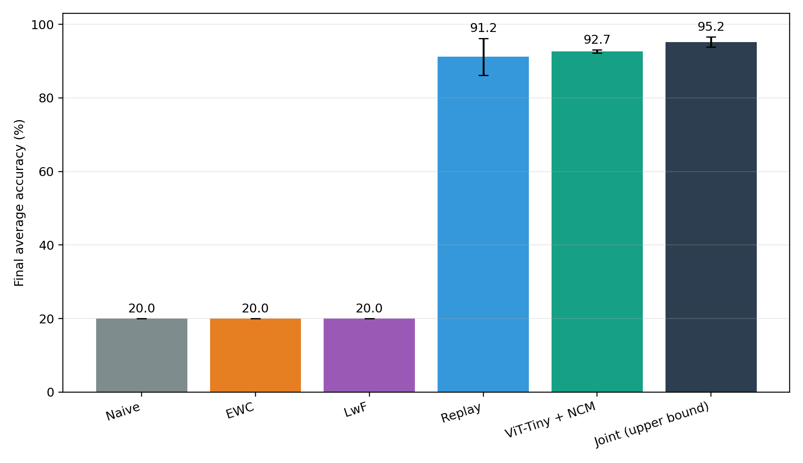
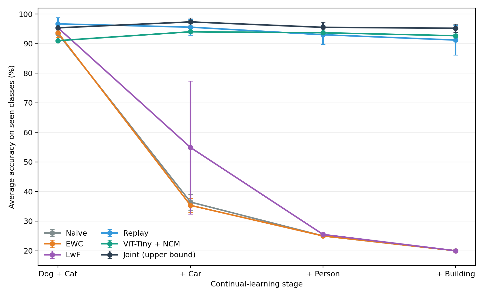
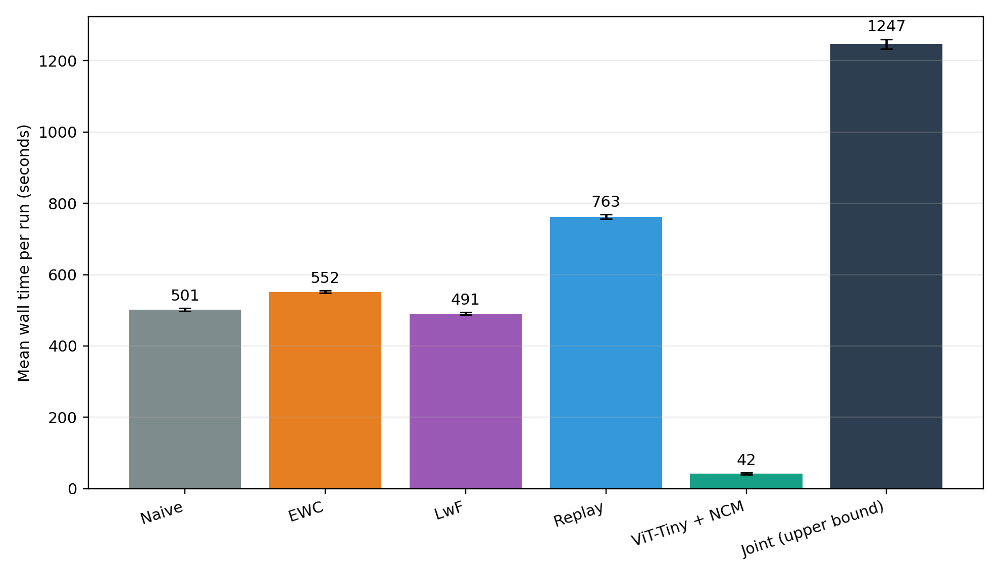
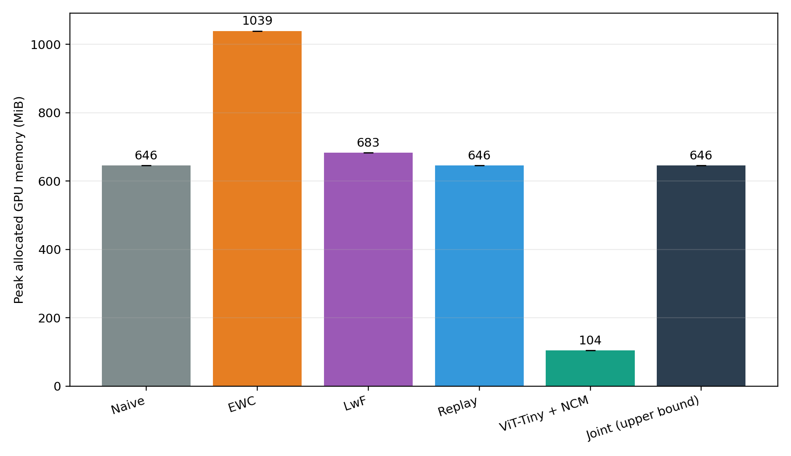
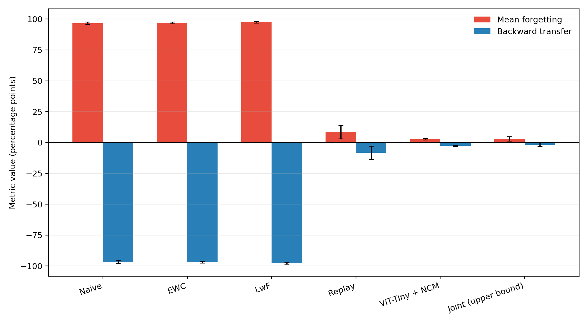

# Phân loại ảnh liên tục không quên thảm họa: so sánh Naive, EWC, LwF, Replay, NCM và Joint trên giao thức class-incremental bốn giai đoạn

> **Bản nháp.** Các ô `[TODO: ...]` cần nhóm điền. Mọi số liệu trong bản nháp lấy trực tiếp
> từ `RESULTS.md`, `outputs/comparison.csv`, `outputs/per_seed_results.csv`,
> `outputs/stage_accuracy.csv` và các file `outputs/colab_runs/*/seed_*/stage_*.json`.
> Không có số liệu nào được ước lượng hay bịa thêm. Trích dẫn `[n]` tương ứng danh sách trong
> `docs/theory/LITERATURE_REVIEW.md`.

**Môn học:** Deep Learning, [TODO: mã môn]
**Đề tài số 26:** Continual Image Classification without Catastrophic Forgetting
**Nhóm:** [TODO: tên thành viên, mã sinh viên]
**Ngày:** [TODO]

---

## Tóm tắt

Đồ án nghiên cứu bài toán phân loại ảnh **class-incremental**: mô hình nhận class mới theo
bốn giai đoạn (Dog+Cat → Car → Person → Building) và phải phân loại đúng mọi class đã học mà
không được xem lại toàn bộ dữ liệu cũ. Nhóm so sánh sáu cách huấn luyện trên cùng dữ liệu,
cùng backbone ViT-Tiny và cùng mã đánh giá: fine-tuning tuần tự (Naive), EWC, LwF, Replay
với bộ nhớ 200 ảnh, bộ phân loại Nearest Class Mean trên ViT-Tiny đóng băng (NCM), và huấn
luyện gộp dữ liệu (Joint) làm mốc trên. Dữ liệu gồm 2.500 ảnh crop từ Open Images V7, mỗi
class 500 ảnh. Mỗi phương pháp chạy 3 seed trên cùng loại GPU Tesla T4 (Google Colab).

Naive, EWC và LwF đều kết thúc ở **20,00 ± 0,00%**, tức mức đoán ngẫu nhiên trên 5 class: mô
hình dự đoán mọi ảnh là Building. Replay đạt **91,20 ± 5,01%**, NCM đạt **92,67 ± 0,46%**, và
Joint đạt **95,20 ± 1,39%**. NCM chạy trọn bốn giai đoạn trong khoảng 42 giây với peak bộ
nhớ PyTorch cấp phát khoảng 104 MiB, so với khoảng 763 giây và 646 MiB của Replay. Kết quả
xác nhận rằng các phương pháp regularization không dùng dữ liệu cũ rất dễ sụp trong kịch bản
class-incremental khi mỗi giai đoạn chỉ có một class, dưới các siêu tham số đã thử. Kết quả
cũng xác nhận rằng đặc trưng pretrained đóng băng cộng NCM là một baseline mạnh và rẻ **trên
bộ dữ liệu này**. Chênh lệch giữa NCM và Replay nhỏ hơn độ biến thiên giữa các seed của
Replay, nên không đủ để khẳng định phương pháp nào tốt hơn.

---

## 1. Giới thiệu

### 1.1. Động lực

Trong nhiều ứng dụng thực tế, dữ liệu không đến một lần mà đến dần theo thời gian: hệ thống
nhận diện sản phẩm có thêm mặt hàng mới, robot gặp vật thể mới. Huấn luyện lại từ đầu với
toàn bộ dữ liệu thì tốn kém, và nhiều khi không làm được vì dữ liệu cũ không còn được lưu
(giới hạn lưu trữ, quyền riêng tư). Khi chỉ huấn luyện tiếp trên dữ liệu mới, mạng nơ-ron gặp
**catastrophic forgetting**: mất nhanh khả năng xử lý dữ liệu cũ [1, 3].

### 1.2. Câu hỏi nghiên cứu

1. Với giao thức class-incremental bốn giai đoạn, fine-tuning tuần tự quên nhiều đến mức
   nào?
2. Các phương pháp chống quên đại diện cho ba hướng (regularization: EWC, LwF; rehearsal:
   Replay; biểu diễn cố định: NCM) giảm quên được bao nhiêu so với Naive, và cách mốc trên
   Joint bao xa?
3. Đổi lại, mỗi phương pháp tốn bao nhiêu thời gian, bộ nhớ GPU và bộ nhớ phụ?

### 1.3. Đóng góp của đồ án

- Một giao thức class-incremental cố định và tái lập được, với bộ dữ liệu 2.500 ảnh cân bằng,
  đã kiểm tra trùng lặp và rò rỉ giữa các tập.
- Một so sánh công bằng: sáu phương pháp dùng chung dữ liệu, thứ tự class, backbone, mã đánh
  giá, 3 seed và cùng loại GPU.
- Phân tích nguyên nhân thất bại của EWC và LwF dựa trên ma trận nhầm lẫn, và báo cáo đồng
  thời độ chính xác lẫn chi phí.

Đồ án **không** đề xuất phương pháp mới. Việc NCM trên đặc trưng pretrained là baseline mạnh
đã được ghi nhận trong tài liệu [21, 22].

---

## 2. Cơ sở lý thuyết

Phần này tóm tắt. Chi tiết và trích dẫn đầy đủ nằm trong `docs/theory/LITERATURE_REVIEW.md`.

- **Kịch bản class-incremental** [6, 7]: khi test, mô hình phải chọn trong mọi class đã thấy
  và không được biết ảnh thuộc giai đoạn nào. Đây là kịch bản khó nhất trong ba kịch bản của
  van de Ven & Tolias.
- **Thiên lệch về class mới** [18, 19]: khi chỉ có dữ liệu class mới, lớp phân loại cuối có
  xu hướng ưu tiên class mới.
- **EWC** [9, 10]: phạt thay đổi của các tham số quan trọng với tri thức cũ, đo bằng đường
  chéo ma trận Fisher.
- **LwF** [12, 13]: giữ đầu ra của mô hình cũ trên dữ liệu mới bằng knowledge distillation,
  không cần lưu ảnh cũ.
- **Replay** [14, 15, 16]: lưu một bộ nhớ nhỏ ảnh cũ và trộn vào khi học class mới.
- **NCM** [17, 20, 21, 22]: mỗi class là một vector trung bình đặc trưng (prototype), phân
  loại theo prototype gần nhất. Khi backbone đóng băng, thêm class chỉ cần tính thêm một
  prototype.

---

## 3. Phương pháp và thiết lập thí nghiệm

### 3.1. Giao thức class-incremental

| Stage | Class mới | Class được đánh giá sau stage |
|---|---|---|
| 0 | Dog, Cat | Dog, Cat |
| 1 | Car | Dog, Cat, Car |
| 2 | Person | Dog, Cat, Car, Person |
| 3 | Building | Dog, Cat, Car, Person, Building |

Mô hình dùng **một head tuyến tính 5 output cố định**. Logit của các class chưa học được che
(mask) bằng giá trị âm rất lớn, nên không có ảnh hay nhãn tương lai nào tham gia huấn luyện.
Khi đánh giá sau stage `k`, mô hình chọn trong mọi class đã thấy tới stage `k`.

Điểm cần lưu ý: ở Stage 1, 2 và 3, dữ liệu huấn luyện mới chỉ có **đúng một class**.

### 3.2. Dữ liệu

- Nguồn: Open Images V7 [28], tải qua tích hợp FiftyOne, lấy từ các split validation và test
  chính thức rồi chia lại theo `original_image_id`.
- Crop theo bounding box với 8% lề ngữ cảnh. Mỗi ảnh gốc đóng góp tối đa một crop. Loại box
  nhóm (group), hình vẽ/mô tả (depiction), cảnh bên trong (inside), box quá nhỏ và file lỗi.
- Person gộp thêm nhãn con Man/Woman/Boy/Girl và loại box bị che khuất hoặc bị cắt. Building
  gộp thêm House/Office building/Skyscraper/Tower/Castle và loại box bị che khuất.
- Tổng 2.500 crop, 500 mỗi class, chia 400 / 50 / 50 mỗi class cho train / validation / test.
- Đã kiểm tra: không thiếu file, không trùng hash, không rò rỉ ảnh gốc giữa các tập, và đã rà
  soát thủ công bằng contact sheet.

Chi tiết trong `DATASET_CARD.md`. Đây là bộ dữ liệu riêng của đồ án, **không** phải đánh giá
trên split test chính thức của Open Images.

### 3.3. Mô hình

- Backbone `vit_tiny_patch16_224` từ thư viện timm, dùng trọng số pretrained mặc định. Trong
  timm 1.0.30 (bản local), đó là tag `augreg_in21k_ft_in1k`: pretrain trên ImageNet-21k rồi
  fine-tune trên ImageNet-1k [25]. Artifact của benchmark không ghi phiên bản timm hoặc tag
  trọng số, nên không thể xác nhận chính xác hai trường này cho 18 run Colab; thông tin trên
  chỉ mô tả môi trường local.
- Kiến trúc: embedding 192 chiều, 12 block Transformer, 3 attention head. Backbone có
  5.524.416 tham số. Đặc trưng là token `[CLS]`.
- Head: `Linear(192, 5)`.

### 3.4. Các phương pháp

| Phương pháp | Cơ chế trong cài đặt | Dữ liệu cũ được dùng | Trạng thái phụ cần lưu |
|---|---|---|---|
| Naive | Fine-tune toàn bộ mô hình trên dữ liệu class mới | Không | Không |
| EWC | Online EWC, `λ = 100`, `γ = 1`, empirical Fisher ước lượng trên ≤ 50 batch | Không | Fisher + tham số neo (2 bản sao tham số) |
| LwF | Cross-entropy + KL distillation trên logit class cũ, `α = 1`, `T = 2`; teacher là mô hình ngay trước stage | Không | Một bản sao mô hình (teacher) trong lúc huấn luyện |
| Replay | Bộ nhớ 200 ảnh, chia đều theo class, chọn ngẫu nhiên; mỗi batch 16 ảnh mới + 16 ảnh nhớ | Có, 200 ảnh | 200 ảnh |
| Frozen ViT-Tiny + NCM | Backbone đóng băng; prototype = trung bình đặc trưng đã chuẩn hóa L2; dự đoán theo cosine similarity | Không | 1 vector 192 chiều mỗi class |
| Joint (mốc trên) | Ở mỗi stage, fine-tune tiếp mô hình trên **toàn bộ** dữ liệu train của các class đã thấy | Có, toàn bộ | Toàn bộ dữ liệu |

Joint **không phải** phương pháp continual learning hợp lệ, vì nó dùng lại toàn bộ dữ liệu cũ.
Lưu ý thêm: Joint ở đây là fine-tune tiếp tục từ stage trước trên dữ liệu gộp, không phải
huấn luyện lại từ đầu trên 5 class. Vì vậy nó là mốc trên **gần đúng**.

### 3.5. Huấn luyện

| Thiết lập | Giá trị |
|---|---|
| Optimizer | AdamW, learning rate 1e-4, weight decay 0,05 |
| Batch size | 32 |
| Số epoch | 20 ở Stage 0; 15 ở mỗi stage sau |
| Optimizer | Khởi tạo lại ở mỗi stage |
| Mixed precision (AMP) | Bật khi dùng CUDA |
| Kích thước ảnh | 224 × 224 |
| Augmentation train | RandomResizedCrop (scale 0,7–1,0), lật ngang, ColorJitter |
| Seed | 42, 123, 2026 |
| Phần cứng | Google Colab, Tesla T4; PyTorch 2.11.0+cu128, CUDA 12.8 |

Các siêu tham số của EWC, LwF và Replay là giá trị mặc định chọn trước, **không được tinh
chỉnh** trên tập validation. [TODO: nhóm xác nhận lại điều này.]

Ngân sách tính toán khác nhau theo thiết kế. Số bước tối ưu đo được ở seed 42:

| Phương pháp | Stage 0 | Stage 1 | Stage 2 | Stage 3 |
|---|---:|---:|---:|---:|
| Naive, EWC, LwF | 500 | 195 | 195 | 195 |
| Replay | 500 | 375 | 375 | 375 |
| Joint | 500 | 570 | 750 | 945 |
| NCM | 0 | 0 | 0 | 0 |

Replay có gần gấp đôi số bước ở các stage tăng dần, vì mỗi batch chỉ lấy 16 ảnh mới. Joint
tăng số bước theo lượng dữ liệu gộp.

### 3.6. Metric

Gọi `a_{k,j}` là accuracy trên class `j` sau stage `k`, và `A_k` là trung bình của `a_{k,j}`
trên các class đã thấy. Vì test set cân bằng (50 ảnh/class), `A_k` bằng overall accuracy.

- **Final accuracy**: `A_3` trên cả 5 class.
- **Average incremental accuracy**: `(A_0 + A_1 + A_2 + A_3) / 4`, theo cách dùng trong
  iCaRL [17].
- **Forgetting** (theo class): với mỗi class `j` trong Dog, Cat, Car, Person, lấy
  `max_k a_{k,j} − a_{3,j}` (max lấy trên mọi lần đánh giá, kể cả lần cuối), rồi lấy trung
  bình. Đây là biến thể theo class của forgetting measure [27].
- **Backward transfer** (theo class): `a_{3,j} − a_{k_j, j}`, với `k_j` là stage học class
  `j`, trung bình trên Dog, Cat, Car, Person. Đây là biến thể theo class của BWT [26].
- **Thời gian**: tổng thời gian thực cho cả bốn stage, gồm huấn luyện và đánh giá.
- **Peak GPU memory**: giá trị lớn nhất của `torch.cuda.max_memory_allocated` qua bốn stage.
  Đây là bộ nhớ PyTorch cấp phát, **không phải** toàn bộ VRAM sử dụng.

Kết quả được báo dưới dạng trung bình ± độ lệch chuẩn mẫu trên 3 seed.

---

## 4. Kết quả

### 4.1. Bảng tổng hợp

| Phương pháp | Final accuracy (%) | Avg. incremental acc. (%) | Forgetting (%) | BWT (%) | Thời gian (s) | Peak GPU memory (MiB) |
|---|---:|---:|---:|---:|---:|---:|
| Naive | 20,00 ± 0,00 | 43,69 ± 1,17 | 96,67 ± 1,04 | −96,67 ± 1,04 | 501,36 ± 4,43 | 645,78 |
| EWC | 20,00 ± 0,00 | 43,50 ± 0,90 | 96,83 ± 0,76 | −96,83 ± 0,76 | 551,75 ± 3,99 | 1039,38 |
| LwF | 20,00 ± 0,00 | 48,93 ± 6,12 | 97,67 ± 0,76 | −97,67 ± 0,76 | 490,55 ± 3,54 | 682,81 |
| Replay | 91,20 ± 5,01 | 94,11 ± 0,85 | 8,50 ± 5,57 | −8,17 ± 5,35 | 762,64 ± 5,90 | 645,78 |
| Frozen ViT-Tiny + NCM | 92,67 ± 0,46 | 92,83 ± 0,19 | 2,67 ± 0,58 | −2,67 ± 0,58 | 42,05 ± 2,62 | 104,16 |
| Joint (mốc trên) | 95,20 ± 1,39 | 95,84 ± 0,70 | 3,00 ± 1,80 | −1,83 ± 1,53 | 1247,07 ± 13,54 | 645,78 |

Peak GPU memory giống hệt nhau giữa các seed của cùng phương pháp (độ lệch chuẩn 0).


*Hình 1. Final accuracy trên 5 class.*

### 4.2. Accuracy qua từng stage

Trung bình 3 seed của `A_k`:

| Phương pháp | Stage 0: Dog/Cat | Stage 1: +Car | Stage 2: +Person | Stage 3: +Building |
|---|---:|---:|---:|---:|
| Naive | 93,33 | 36,44 | 25,00 | 20,00 |
| EWC | 93,67 | 35,33 | 25,00 | 20,00 |
| LwF | 95,33 | 54,89 | 25,50 | 20,00 |
| Replay | 96,67 | 95,56 | 93,00 | 91,20 |
| Frozen ViT-Tiny + NCM | 91,00 | 94,00 | 93,67 | 92,67 |
| Joint (mốc trên) | 95,33 | 97,33 | 95,50 | 95,20 |


*Hình 2. Accuracy trung bình sau mỗi stage.*

Với Naive và EWC, sau Stage 2 accuracy bằng đúng 25% (= 1/4). Sau Stage 3, accuracy bằng
đúng 20% (= 1/5) ở cả 3 seed. Accuracy từng class sau Stage 3 cho thấy lý do: với Naive, EWC
và LwF, **Building đạt 100% và mọi class khác đạt 0%** ở cả 9 run. Mô hình đã dự đoán mọi
ảnh là class vừa học.

### 4.3. Kết quả theo seed

| Phương pháp | Seed 42 | Seed 123 | Seed 2026 |
|---|---:|---:|---:|
| Replay (final acc.) | 96,0 | 86,0 | 91,6 |
| NCM (final acc.) | 92,4 | 92,4 | 93,2 |
| Joint (final acc.) | 96,0 | 93,6 | 96,0 |
| LwF (acc. sau Stage 1) | 48,0 | 36,7 | 80,0 |

Thứ hạng giữa Replay và NCM **không ổn định** theo seed: Replay cao hơn NCM ở seed 42 nhưng
thấp hơn ở seed 123 và 2026. Ở seed 123, Replay chỉ còn 58% trên Dog sau Stage 3.

### 4.4. Chi phí


*Hình 3. Thời gian thực cho cả bốn stage trên Tesla T4.*


*Hình 4. Peak bộ nhớ PyTorch cấp phát.*


*Hình 5. Forgetting và backward transfer.*

- NCM nhanh hơn Replay khoảng 18 lần (42,05 s so với 762,64 s) và nhanh hơn Joint khoảng 30
  lần (1247,07 s). Lý do là NCM không có bước huấn luyện nào: nó chỉ trích đặc trưng một lần
  cho mỗi ảnh train.
- Peak bộ nhớ PyTorch cấp phát của NCM (104,16 MiB) thấp hơn Replay (645,78 MiB) khoảng 84%
  và thấp hơn EWC (1039,38 MiB) khoảng 90%.
- Bộ nhớ phụ riêng của từng phương pháp nằm ngoài con số GPU ở trên: Replay lưu 200 ảnh; NCM
  lưu 5 vector 192 chiều; EWC lưu Fisher và tham số neo, tương đương 2 bản sao tham số; LwF
  giữ một mô hình teacher trong lúc huấn luyện.

---

## 5. Thảo luận

### 5.1. Vì sao Naive sụp hoàn toàn

Ở mỗi stage tăng dần, toàn bộ nhãn huấn luyện là **một class duy nhất**. Cross-entropy trên
các logit đã thấy đạt giá trị nhỏ chỉ bằng cách đẩy logit class mới lên trên mọi logit cũ.
Sau 195 bước tối ưu với learning rate 1e-4 trên toàn bộ ViT, mô hình học đúng lối tắt đó:
**dự đoán mọi ảnh là class mới**. Đây là dạng cực đoan của thiên lệch về class mới đã được mô
tả trong tài liệu [18, 19], và giải thích vì sao accuracy rơi đúng về 1/3, 1/4, 1/5 (khi mọi
ảnh cũ bị đoán sai).

### 5.2. Vì sao EWC và LwF không cứu được

**LwF.** Loss distillation của cài đặt so khớp softmax **chỉ trên các logit class cũ**. Softmax
này không đổi khi mọi logit cũ cùng giảm một lượng như nhau. Vì vậy LwF giữ được việc phân
biệt Dog với Cat, nhưng không ngăn Car vượt lên trên cả hai. Ma trận nhầm lẫn của LwF, seed
2026, sau Stage 1 (trên test set) minh họa điều này:

| Thực tế \ Dự đoán | Dog | Cat | Car |
|---|---:|---:|---:|
| Dog | 37 | 1 | 12 |
| Cat | 0 | 33 | 17 |
| Car | 0 | 0 | 50 |

Trong 30 ảnh Dog/Cat bị đoán sai, 29 ảnh bị đoán là Car, class mới. Chỉ 1 ảnh bị nhầm giữa
Dog và Cat. Đây đúng là hiện tượng Zhao et al. mô tả: distillation giữ khả năng phân biệt
giữa các class cũ nhưng không chống được thiên lệch về class mới [19]. LwF gốc được thiết kế
với head riêng cho mỗi task [12], nên không gặp vấn đề này trong kịch bản task-incremental.

**EWC.** Theo van de Ven & Tolias [6], các phương pháp regularization như EWC thất bại trong
kịch bản class-incremental. Trong đồ án, EWC cho kết quả gần như trùng Naive ở mọi stage. Hai
nguyên nhân có thể (chưa được kiểm chứng bằng thí nghiệm riêng):

1. `λ = 100` có thể quá nhỏ so với độ lớn Fisher của ViT-Tiny.
2. Fisher được ước lượng bằng empirical Fisher [11] trên dữ liệu một-class. Sau khi mô hình
   đã khớp dữ liệu này, gradient rất nhỏ, nên Fisher ở Stage 1–3 có thể gần bằng 0 và số hạng
   phạt gần như không có tác dụng.

Ngay cả khi giữ được tham số backbone, EWC vẫn không giải quyết trực tiếp thiên lệch ở lớp
phân loại cuối. Để kiểm chứng, cần ghi lại độ lớn số hạng phạt EWC theo bước, và thử quét `λ`
trên tập validation.

**Kết luận thận trọng:** EWC và LwF thất bại **dưới các siêu tham số đã thử và giao thức một-
class-mỗi-stage này**. Đồ án không chứng minh rằng hai phương pháp luôn thất bại.

### 5.3. Replay: hiệu quả nhưng biến thiên

Chỉ với 200 ảnh (10% tập train), Replay giữ được accuracy 91,20% sau Stage 3, tức giảm
forgetting từ khoảng 97% xuống 8,5%. Tuy nhiên độ lệch chuẩn giữa các seed lớn (5,01 điểm so
với 0,46 của NCM), và ở seed 123 accuracy của Dog chỉ còn 58%. Các nguồn biến thiên có thể
gồm: nội dung bộ nhớ (chọn ngẫu nhiên theo seed); việc mỗi ảnh trong bộ nhớ được lặp lại rất
nhiều lần (bộ nhớ 50 ảnh/class ở Stage 3, mỗi batch lấy 16 ảnh nhớ, trong 375 bước), có thể
dẫn tới overfit bộ nhớ; và tính không tất định của huấn luyện GPU (mục 6).

### 5.4. NCM: mạnh và rẻ, nhưng vì sao

NCM đạt 92,67%, chỉ thấp hơn Joint 2,53 điểm. Nó cũng có forgetting thấp (2,67%) vì backbone
không thay đổi. Phần forgetting còn lại đến từ việc thêm prototype mới làm tăng nhầm lẫn giữa
các class, không phải từ việc ghi đè tham số.

Cần diễn giải đúng kết quả này:

- Sức mạnh của NCM đến chủ yếu từ **đặc trưng pretrained trên ImageNet-21k**, vốn đã phân tách
  tốt năm khái niệm phổ biến này. Kết quả phù hợp với các báo cáo trước [21, 22].
- NCM **không** miễn phí: chi phí trích đặc trưng tăng tuyến tính theo số ảnh mới.
- NCM **không** học được đặc trưng mới. Nếu miền dữ liệu khác xa ImageNet (ảnh y tế, ảnh vệ
  tinh), class tinh (nhiều giống chó), hoặc class đa dạng về hình thức, một prototype mỗi
  class có thể không đủ. Building là ví dụ: đây là class có accuracy NCM thấp thứ hai (92%)
  sau Cat (86%).
- Accuracy trung bình của NCM **tăng** từ Stage 0 (91,0%) lên Stage 1 (94,0%). Điều này không
  có nghĩa là mô hình học ngược. Cặp Dog/Cat là cặp khó nhất, và thêm Car (dễ phân biệt) làm
  trung bình tăng lên.

### 5.5. Có thể kết luận NCM tốt hơn Replay không?

**Không**, với dữ liệu hiện có. Chênh lệch trung bình 1,47 điểm nhỏ hơn độ lệch chuẩn của
Replay (5,01), thứ hạng đảo chiều theo seed (mục 4.3), và chỉ có 3 seed. Ngoài ra test set
chỉ có 250 ảnh, nên 1 ảnh tương ứng 0,4 điểm final accuracy. Kết luận an toàn là: **trên bộ dữ
liệu này, NCM đạt accuracy tương đương Replay với chi phí thấp hơn nhiều và ổn định hơn giữa
các seed**.

### 5.6. Về chi phí

- Thời gian khác nhau chủ yếu do **ngân sách tính toán đã cấu hình** (số epoch, số bước), không
  phải bản chất thuật toán. NCM không có bước huấn luyện nào.
- Chênh lệch thời gian nhỏ không đáng tin. Ví dụ, LwF có thêm một lượt forward của teacher mỗi
  bước nhưng lại chạy nhanh hơn Naive (490,55 s so với 501,36 s). Cùng 195 bước, Stage 2 của
  Naive (seed 42) mất 64,9 s còn Stage 1 mất 91,1 s.
- Peak memory cao của EWC (1039,38 MiB) xuất hiện **ngay ở Stage 0**, khi số hạng phạt còn
  bằng 0. Vậy nó đến từ bước ước lượng Fisher, bước này chạy không dùng mixed precision. Con
  số này phản ánh cài đặt, không phải chi phí tất yếu của EWC.

---

## 6. Hạn chế

Chi tiết trong `docs/report/LIMITATIONS_AND_THREATS.md`. Các điểm chính:

- **Tính không tất định:** ở Stage 0, Naive, EWC, LwF, Replay và Joint chạy cùng một thuật toán
  (Fisher và teacher chưa có tác dụng, bộ nhớ Replay còn rỗng) với cùng seed, nhưng accuracy
  Stage 0 ở seed 42 dao động từ 91% (Naive) tới 99% (Replay). Độ dao động này cùng cỡ với
  nhiều chênh lệch giữa các phương pháp.
- Chỉ 3 seed, test set nhỏ (50 ảnh/class), không có kiểm định thống kê.
- Chỉ một thứ tự class, một giao thức một-class-mỗi-stage.
- Không tinh chỉnh siêu tham số cho EWC, LwF, Replay.
- Ảnh crop dễ hơn phân loại cả cảnh. Backbone pretrained trên ImageNet-21k có lợi thế lớn.
- Joint là fine-tune tiếp tục, không phải huấn luyện lại từ đầu.

---

## 7. Kết luận và hướng phát triển

Trong giao thức class-incremental bốn stage, với mỗi stage tăng dần chỉ có một class:

1. Fine-tuning tuần tự quên gần như hoàn toàn: final accuracy 20%, forgetting khoảng 97%.
2. EWC và LwF, dưới siêu tham số đã thử, không cải thiện so với Naive, vì không chống được
   thiên lệch về class mới ở lớp phân loại một-head.
3. Replay với 200 ảnh phục hồi phần lớn hiệu năng (91,20%) nhưng biến thiên lớn theo seed.
4. Frozen ViT-Tiny + NCM đạt 92,67%, sát mốc trên Joint, với thời gian và bộ nhớ GPU thấp hơn
   hẳn. Đây là baseline mạnh **trên bộ dữ liệu gần với miền pretrain**, không phải lời giải
   tổng quát.

Hướng phát triển:

- Tinh chỉnh `λ` của EWC và `α`, `T` của LwF trên tập validation; ghi lại độ lớn Fisher.
- Thêm các cơ chế chống thiên lệch lớp phân loại như BiC [18] hoặc Weight Aligning [19].
- Chọn bộ nhớ Replay bằng herding [17] thay vì ngẫu nhiên, và thử nhiều kích thước bộ nhớ.
- Thử nhiều thứ tự class, nhiều seed hơn, và một miền dữ liệu xa ImageNet để kiểm tra giới hạn
  của NCM.
- Kết hợp backbone đóng băng với thích nghi nhẹ, theo hướng APER [22].
- Bật chế độ tất định đầy đủ của PyTorch để giảm biến thiên giữa các run.

---

## Phụ lục A. Tái lập

```powershell
python scripts/run_benchmark.py --device cuda
python scripts/summarize_results.py
.venv\Scripts\python.exe scripts\plot_final_results.py
```

Nguồn gốc số liệu: `outputs/FINAL_RESULTS_PROVENANCE.md`.

## Phụ lục B. Kết quả từng seed

| Phương pháp | Seed | Final acc. | Avg. incr. acc. | Forgetting | BWT | Thời gian (s) |
|---|---:|---:|---:|---:|---:|---:|
| Naive | 42 | 20,0 | 42,50 | 95,5 | −95,5 | 498,69 |
| Naive | 123 | 20,0 | 43,75 | 97,0 | −97,0 | 498,93 |
| Naive | 2026 | 20,0 | 44,83 | 97,5 | −97,5 | 506,47 |
| EWC | 42 | 20,0 | 43,25 | 97,0 | −97,0 | 549,37 |
| EWC | 123 | 20,0 | 44,50 | 97,5 | −97,5 | 556,36 |
| EWC | 2026 | 20,0 | 42,75 | 96,0 | −96,0 | 549,52 |
| LwF | 42 | 20,0 | 47,13 | 97,5 | −97,5 | 491,34 |
| LwF | 123 | 20,0 | 43,92 | 97,0 | −97,0 | 493,62 |
| LwF | 2026 | 20,0 | 55,75 | 98,5 | −98,5 | 486,67 |
| Replay | 42 | 96,0 | 95,04 | 3,5 | −3,5 | 766,39 |
| Replay | 123 | 86,0 | 93,38 | 14,5 | −14,0 | 765,69 |
| Replay | 2026 | 91,6 | 93,90 | 7,5 | −7,0 | 755,84 |
| NCM | 42 | 92,4 | 92,73 | 3,0 | −3,0 | 40,17 |
| NCM | 123 | 92,4 | 92,73 | 3,0 | −3,0 | 45,04 |
| NCM | 2026 | 93,2 | 93,05 | 2,0 | −2,0 | 40,95 |
| Joint | 42 | 96,0 | 96,54 | 2,5 | −0,5 | 1231,50 |
| Joint | 123 | 93,6 | 95,15 | 5,0 | −3,5 | 1256,09 |
| Joint | 2026 | 96,0 | 95,83 | 1,5 | −1,5 | 1253,62 |
